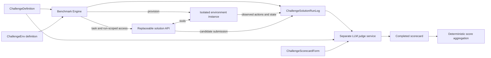

# Architecture and ownership

## Three challenge modules

1. **ChallengeDefinition** describes the task, capabilities, constraints, version,
   and budgets. It does not prescribe the candidate's action sequence.
2. **ChallengeEnv** describes initial fixtures, failures, implementation, and
   reset/isolation semantics. The engine owns each concrete environment instance.
3. **ChallengeScorecardForm** defines immutable questions, weights, evaluator type,
   answer anchors, and evidence requirements. It never contains a candidate score.

The engine and judge are reusable services, not additional challenge modules.
The candidate may be an n8n workflow, program, or remote API. Neither service
imports candidate code or uses candidate-generated values as authoritative state.

## Execution lifecycle

1. Validate solution manifest, resolve challenge, freeze package and hashes.
2. Create a fresh child environment process with independent state and two
   credentials: a solution tool token and a benchmark administrative token.
3. Start the solution via HTTP. It owns all planning, delegation, retries, and
   tool choice. The engine only enforces the execution contract and deadline.
4. Poll status. Completion means the solution stopped; it does not establish success.
5. Freeze the environment immediately on stop/deadline. Further tool calls fail.
6. Collect environment events and snapshots; execute protected state checks.
7. Assemble and validate the log; redact credentials; persist its digest.
8. Send definition, frozen log, and scorecard to the independent judge.
9. Validate per-criterion answers and evidence references; compute the weighted
   score in code; save a report and judge provenance.

Failed solution attempts can still be scored if sufficient evidence exists.
Environment/infrastructure failures remain explicit errors. Judge failures remain
unscored. No retries silently replace failed attempts with a better run.

## Evidence ownership is mandatory

**The authoritative log is assembled by the engine from four sources:**

| Source | Recorded by | Meaning |
|---|---|---|
| Environment | Benchmark-owned environment | Actual tool requests, results, errors, state changes |
| Engine | Benchmark engine | Timing, deadline, lifecycle, termination |
| Candidate | Solution and its adapter | Final answer, artifacts, optional self-reported trace |
| Verification | Protected verifier | Before/after comparisons and executable checks |

The engine stamps evidence IDs and provenance. A candidate cannot upload an
`environment` event, choose a verifier result, set elapsed time, or supply a score.
Every judge answer cites recorded event IDs. Deterministic facts are filled by
verification and cannot be overridden by the model.

Internal agents can be opaque. An actor label in a candidate trace is a claim,
not proof of an independently executing specialist. If internal multi-agent
behavior is a benchmark requirement, add trusted runtime instrumentation in a new
challenge version; do not infer it from final output.

## Comparison and replay

A scored unit is `(challenge package, seed, solution version, run_id, judge config)`.
Compare matched seeds and frozen package versions, not only solution names.
Every rescore creates a new judgement artifact while retaining the frozen run.
The dashboard shows the most recent validated assessment and links to source data.
The current UI is a run explorer; it does not claim statistical significance or
automatically aggregate different challenges into one league table.
